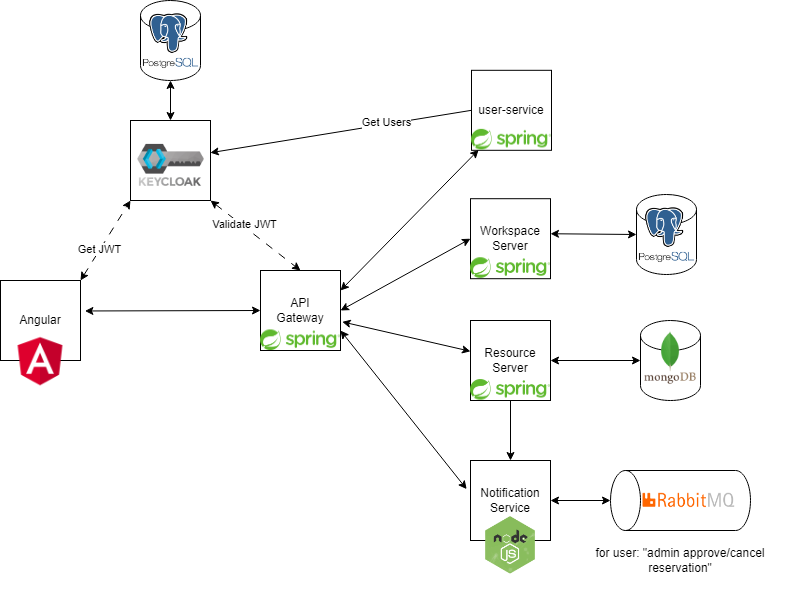

# Resource Reservation Platform

This platform offers users the ability to efficiently organize resources such as laptops, projectors, and similar devices through a convenient reservation system. The frontend application, built with Angular, provides users with an intuitive and responsive interface.

## Technologies Used

The Resource Reservation Platform leverages a diverse set of technologies for various components:

- **Frontend:**
  - Angular

- **Backend:**
  - Spring Boot (resource-service)
  - Node with TypeScript (notification-service)

- **Security:**
  - Keycloak

- **Message Queue:**
  - RabbitMQ (used for notification-service)

- **Databases:**
  - MongoDB (used for resource-service)
  - PostgreSQL (used for Keycloak users)

- **Communication:**
  - Spring Cloud Gateway (used for api-gateway)

- **Containerization:**
  - Docker
  - Docker Compose

## Architecture

The backend is structured as a set of microservices, while communication between the frontend and these microservices is efficiently managed through an API gateway.

## Security

Security is a top priority. The system leverages Keycloak to establish a robust authorization mechanism, ensuring that only authorized users have access to reservations and other application functionalities.
You can read more here: [Keycloak configuration](./keycloak/README.md).


## Dockerization

The entire project is dockerized using a multi-stage build strategy combined with docker-compose.

### Running the Entire Project

To launch the entire project in containers, use the following command:

```bash
docker compose up -d -V --build
```
For initial testing and exploration, the platform provides default users:

- **Admin User:**
  - Username: admin
  - Password: admin

- **Regular User:**
  - Username: user
  - Password: user

### Rebuilding and Starting a Specific Service

To rebuild and start a specific service from the docker-compose setup, use:

```bash
docker-compose up -d --no-deps --build <service_name>
```

## Visual Appearance




Enjoy seamless management and deployment of your Resource Reservation Platform with Docker and Docker Compose!

